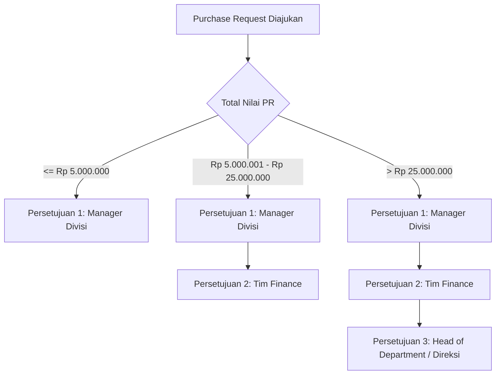

# Product Requirements Document (PRD) - OrderFlow
**Version:** 1.0 (MVP)  
**Status:** Approved  
**Author:** OrderFlow Engineering Team  

---

## 1. Executive Summary & Problem Statement

### 1.1 Latar Belakang Masalah
Pada banyak perusahaan berkembang, proses pengadaan barang (*procurement*) masih dilakukan secara manual menggunakan chat WhatsApp, email, dan spreadsheet. Hal ini menimbulkan berbagai masalah krusial:
1. **Persetujuan Informal & Lambat:** Karyawan kesulitan melacak status persetujuan atasan.
2. **Risiko Kecurangan (*Fraud*) & Pemborosan:** Pembelian tanpa perbandingan harga (*quotation*) dan tanpa verifikasi anggaran (*budget*).
3. **Penerimaan Tidak Tervalidasi:** Barang yang datang tidak dicocokkan dengan pesanan awal.
4. **Pembayaran Ganda / Salah Harga:** Bagian keuangan (*Finance*) membayar tagihan vendor tanpa mencocokkan *Purchase Order*, bukti surat jalan, dan *Invoice* (*3-Way Matching*).
5. **Ketiadaan Riwayat Audit (*Audit Trail*):** Sulit melacak siapa yang meminta, menyetujui, dan mengubah data transaksi.

### 1.2 Tujuan Solusi (OrderFlow)
OrderFlow menyediakan satu platform terpusat untuk mengelola seluruh siklus pengadaan barang/jasa internal:
$$\text{Purchase Request} \longrightarrow \text{Approval} \longrightarrow \text{RFQ \& Comparison} \longrightarrow \text{Purchase Order} \longrightarrow \text{Goods Receipt} \longrightarrow \text{Invoice 3-Way Match} \longrightarrow \text{Payment}$$

---

## 2. Pengguna Sistem & Hak Akses (User Persona & RBAC)

| Role | Deskripsi Singkat | Wewenang Utama |
|---|---|---|
| **Requester (Karyawan)** | Karyawan internal dari divisi mana pun | Membuat PR, memantau status pengajuan, input tanda terima barang (Goods Receipt). |
| **Manager** | Kepala Divisi / Atasan Pemohon | Menyetujui (*Approve*), menolak (*Reject*), atau meminta revisi (*Request Revision*) PR bawahannya. |
| **Procurement** | Tim Pengadaan Barang / Purchasing | Mengelola master vendor, input RFQ/Quotation, membandingkan vendor, menerbitkan Purchase Order (PO) resmi. |
| **Finance** | Tim Keuangan & Anggaran | Menyetujui PR bernilai besar ($> \text{Rp5.000.000}$), melakukan verifikasi *3-Way Matching* (PO vs GR vs Invoice), mencatat pembayaran. |
| **Admin** | Administrator Sistem | Mengelola master user, departemen, role, kategori barang, dan pengaturan sistem. |
| **Auditor / Management** | Pimpinan Eksekutif & Pemeriksa | Melihat laporan pengeluaran, analitik dashboard, dan riwayat audit (*audit trail*). |

---

## 3. Matriks Alur Persetujuan Bertingkat (Approval Matrix)

Alur persetujuan berjalan otomatis berdasarkan total estimasi nilai *Purchase Request*:

*Catatan Bisnis:*
- Jika salah satu approver menolak (*reject*), pengajuan berhenti dan wajib menyertakan alasan penolakan.
- Jika approver meminta revisi (*revision*), status kembali ke pemohon untuk diperbaiki tanpa perlu membuat pengajuan dari nol.
- Pemohon (*Requester*) tidak diperbolehkan menyetujui pengajuannya sendiri.

---

## 4. 8 Aturan Bisnis Wajib (Business Rules)

1. **Integritas PO:** Purchase Order (PO) hanya dapat dibuat dari Purchase Request yang telah disetujui 100% oleh semua approver.
2. **Kewajiban Quotation:** Pembelian dengan total nilai di atas Rp10.000.000 wajib memiliki minimal **2 penawaran vendor (quotations)** yang dibandingkan sebelum PO diterbitkan.
3. **Pencegahan Over-Delivery:** Jumlah barang yang diinput pada *Goods Receipt* tidak boleh melebihi kuantitas yang tertera pada *Purchase Order*.
4. **Three-Way Matching:** Invoice vendor tidak dapat disetujui untuk pembayaran jika terjadi selisih harga unit atau kuantitas terhadap PO dan Goods Receipt, kecuali ada *dispute approval*.
5. **Immutability Transaksi Terbit:** PR yang sudah terbit menjadi PO tidak boleh dihapus (*hard delete*).
6. **Penomoran Unik Otomatis:** Sistem menggunakan format nomor transaksi terstandarisasi:
   - PR: `PR-YYYY-MM-XXXX` (contoh: `PR-2026-09-0001`)
   - PO: `PO-YYYY-MM-XXXX` (contoh: `PO-2026-09-0001`)
   - GR: `GR-YYYY-MM-XXXX` (contoh: `GR-2026-09-0001`)
   - INV: `INV-YYYY-MM-XXXX` (contoh: `INV-2026-09-0001`)
7. **Audit Trail Anti-Tamper:** Setiap perubahan status, approval, penolakan, dan edit data dicatat secara permanen tanpa opsi edit/hapus manual.
8. **Isolasi Data Divisi:** Manager hanya dapat melihat dan menyetujui PR dari divisi yang dipimpinnya.
