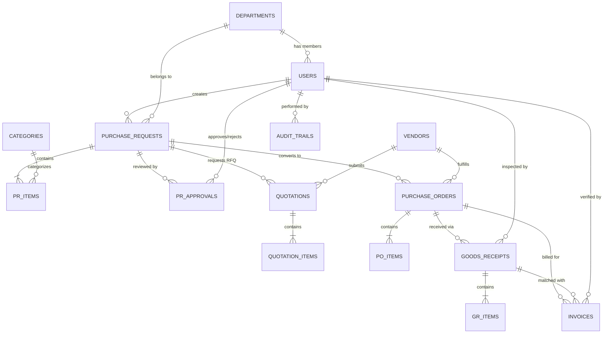

# Entity Relationship Diagram (ERD) & Kamus Data - OrderFlow

Dokumen ini mendefinisikan rancangan struktur basis data MySQL untuk sistem **OrderFlow**.

---

## 1. Diagram Relasi Entitas (ERD)

---

## 2. Kamus Data Rinci (Data Dictionary)

### 2.1 Tabel `departments` (Divisi/Departemen)
Menyimpan data divisi kerja di perusahaan (IT, HR, Finance, Marketing, Operasional, dll.).

| Field | Tipe Data | Keterangan & Aturan |
|---|---|---|
| `id` | BIGINT UNSIGNED (PK, AI) | Primary Key |
| `name` | VARCHAR(100) | Nama departemen (cth: "Information Technology") |
| `code` | VARCHAR(10) (UNIQUE) | Kode singkat (cth: "IT", "FIN", "HRD") |
| `manager_id` | BIGINT UNSIGNED (NULLABLE) | FK ke `users.id` (Kepala Divisi) |
| `created_at` / `updated_at` | TIMESTAMP | Waktu pembuatan & pembaruan data |

---

### 2.2 Tabel `users` (Pengguna Sistem)
Menyimpan akun pengguna, kredensial login, peran, dan divisinya.

| Field | Tipe Data | Keterangan & Aturan |
|---|---|---|
| `id` | BIGINT UNSIGNED (PK, AI) | Primary Key |
| `name` | VARCHAR(150) | Nama lengkap karyawan |
| `email` | VARCHAR(150) (UNIQUE) | Email kerja untuk login |
| `password` | VARCHAR(255) | Password ter-hash (Bcrypt) |
| `role` | ENUM | `'requester'`, `'manager'`, `'procurement'`, `'finance'`, `'admin'`, `'auditor'` |
| `department_id` | BIGINT UNSIGNED (FK) | Relasi ke `departments.id` |
| `phone` | VARCHAR(20) (NULLABLE) | Nomor telepon / WhatsApp |
| `is_active` | BOOLEAN | Status aktif akun (Default: `true`) |
| `created_at` / `updated_at` | TIMESTAMP | Standar audit waktu |

---

### 2.3 Tabel `vendors` (Penyedia Barang/Jasa)
Menyimpan data rekanan vendor/supplier resmi perusahaan.

| Field | Tipe Data | Keterangan & Aturan |
|---|---|---|
| `id` | BIGINT UNSIGNED (PK, AI) | Primary Key |
| `code` | VARCHAR(20) (UNIQUE) | Kode unik vendor (cth: `VND-001`) |
| `name` | VARCHAR(150) | Nama legal vendor (PT/CV/Toko) |
| `category` | VARCHAR(100) | Kategori (Hardware IT, Alat Tulis, Jasa Kebersihan, dll.) |
| `contact_person`| VARCHAR(100) | Nama kontak representatif |
| `email` | VARCHAR(150) | Email resmi vendor |
| `phone` | VARCHAR(25) | Nomor telepon/kontak vendor |
| `address` | TEXT | Alamat kantor vendor |
| `tax_number` | VARCHAR(50) (NULLABLE) | NPWP / Nomor Pokok Wajib Pajak |
| `bank_name` | VARCHAR(50) (NULLABLE) | Nama Bank untuk pembayaran (BCA, Mandiri, dll.) |
| `bank_account_no`| VARCHAR(50) (NULLABLE)| Nomor Rekening |
| `bank_account_name`| VARCHAR(150) (NULLABLE)| Nama Pemilik Rekening |
| `rating` | DECIMAL(3,2) (DEFAULT 5.00)| Skor performa vendor (1.00 - 5.00) |
| `is_active` | BOOLEAN | Status aktif vendor (Default: `true`) |
| `created_at` / `updated_at` | TIMESTAMP | Waktu sistem |

---

### 2.4 Tabel `purchase_requests` (Pengajuan Pembelian)
Header dokumen pengajuan pembelian dari karyawan.

| Field | Tipe Data | Keterangan & Aturan |
|---|---|---|
| `id` | BIGINT UNSIGNED (PK, AI) | Primary Key |
| `pr_number` | VARCHAR(30) (UNIQUE) | Nomor PR otomatis (cth: `PR-2026-09-0001`) |
| `user_id` | BIGINT UNSIGNED (FK) | Pemohon (relasi ke `users.id`) |
| `department_id` | BIGINT UNSIGNED (FK) | Divisi pemohon (relasi ke `departments.id`) |
| `title` | VARCHAR(200) | Judul pengadaan (cth: "Pengadaan 5 Laptop Developer") |
| `description` | TEXT (NULLABLE) | Alasan & justifikasi kebutuhan bisnis |
| `required_date` | DATE | Tanggal barang dibutuhkan tiba di kantor |
| `estimated_total`| DECIMAL(15,2) | Total estimasi biaya seluruh item |
| `status` | ENUM | `'draft'`, `'pending_approval'`, `'approved'`, `'rejected'`, `'revision_requested'`, `'procurement_in_progress'`, `'po_created'`, `'completed'`, `'cancelled'` |
| `attachment_path`| VARCHAR(255) (NULLABLE)| File pendukung (PDF/Image) |
| `created_at` / `updated_at` | TIMESTAMP | Waktu pengajuan & perubahan |

---

### 2.5 Tabel `pr_items` (Rincian Item Purchase Request)
Menyimpan setiap baris barang/jasa yang diajukan dalam satu PR.

| Field | Tipe Data | Keterangan & Aturan |
|---|---|---|
| `id` | BIGINT UNSIGNED (PK, AI) | Primary Key |
| `purchase_request_id` | BIGINT UNSIGNED (FK) | Relasi ke `purchase_requests.id` (CASCADE DELETE saat draft) |
| `item_name` | VARCHAR(200) | Nama barang / jasa spesifik |
| `specification` | TEXT (NULLABLE) | Spesifikasi teknis barang (RAM, Merk, Tipe, dll.) |
| `quantity` | INT UNSIGNED | Jumlah unit yang diminta |
| `unit` | VARCHAR(20) | Satuan (Unit, Pcs, Box, Rim, Jam, dll.) |
| `estimated_unit_price` | DECIMAL(15,2) | Estimasi harga satuan per unit |
| `subtotal` | DECIMAL(15,2) | `quantity * estimated_unit_price` |
| `created_at` / `updated_at` | TIMESTAMP | Waktu dibuat |

---

### 2.6 Tabel `pr_approvals` (Log Persetujuan Bertingkat)
Menyimpan riwayat setiap tahap persetujuan (*approval tier*).

| Field | Tipe Data | Keterangan & Aturan |
|---|---|---|
| `id` | BIGINT UNSIGNED (PK, AI) | Primary Key |
| `purchase_request_id` | BIGINT UNSIGNED (FK) | Relasi ke `purchase_requests.id` |
| `tier_level` | INT UNSIGNED | Tingkat approval (1: Manager, 2: Finance, 3: HoD) |
| `role_required` | VARCHAR(50) | Role yang berhak menyetujui tahap ini |
| `approver_id` | BIGINT UNSIGNED (FK, NULLABLE)| Relasi ke `users.id` yang melakukan aksi |
| `status` | ENUM | `'pending'`, `'approved'`, `'rejected'`, `'revision_requested'` |
| `notes` | TEXT (NULLABLE) | Komentar/alasan persetujuan/penolakan (Wajib jika reject) |
| `acted_at` | TIMESTAMP (NULLABLE) | Waktu tombol diproses oleh approver |
| `created_at` / `updated_at` | TIMESTAMP | Waktu rekaman |

---

### 2.7 Tabel `quotations` & `quotation_items` (Penawaran Vendor / RFQ)
Menyimpan perbandingan harga dari beberapa vendor untuk satu PR.

#### Tabel `quotations`
| Field | Tipe Data | Keterangan |
|---|---|---|
| `id` | BIGINT UNSIGNED (PK, AI) | Primary Key |
| `purchase_request_id` | BIGINT UNSIGNED (FK) | Relasi ke `purchase_requests.id` |
| `vendor_id` | BIGINT UNSIGNED (FK) | Relasi ke `vendors.id` |
| `quotation_number` | VARCHAR(100) (NULLABLE) | Nomor surat penawaran dari vendor |
| `total_price` | DECIMAL(15,2) | Total harga penawaran |
| `shipping_cost` | DECIMAL(15,2) (DEFAULT 0)| Biaya ongkos kirim |
| `grand_total` | DECIMAL(15,2) | `total_price + shipping_cost` |
| `estimated_lead_time_days` | INT UNSIGNED | Estimasi hari pengiriman (cth: 3 hari) |
| `warranty_info` | VARCHAR(150) (NULLABLE) | Info garansi (cth: "Garansi Resmi 2 Tahun") |
| `valid_until` | DATE (NULLABLE) | Batas masa berlaku penawaran harga |
| `file_path` | VARCHAR(255) (NULLABLE) | Lampiran file PDF quotation resmi vendor |
| `is_selected` | BOOLEAN (DEFAULT FALSE) | Ditandai `true` jika dipilih oleh Procurement |
| `selection_reason` | TEXT (NULLABLE) | Alasan pemilihan vendor pemenang |
| `created_at` / `updated_at` | TIMESTAMP | Waktu input penawaran |

---

### 2.8 Tabel `purchase_orders` & `po_items` (Surat Pesanan Resmi)
Menyimpan kontrak pesanan pembelian resmi yang dikirim ke vendor pemenang.

#### Tabel `purchase_orders`
| Field | Tipe Data | Keterangan |
|---|---|---|
| `id` | BIGINT UNSIGNED (PK, AI) | Primary Key |
| `po_number` | VARCHAR(30) (UNIQUE) | Nomor PO resmi (cth: `PO-2026-09-0001`) |
| `purchase_request_id` | BIGINT UNSIGNED (FK) | Relasi ke `purchase_requests.id` |
| `vendor_id` | BIGINT UNSIGNED (FK) | Relasi ke `vendors.id` |
| `issued_by` | BIGINT UNSIGNED (FK) | User Procurement yang menerbitkan (FK ke `users.id`) |
| `order_date` | DATE | Tanggal penerbitan PO |
| `delivery_target_date` | DATE (NULLABLE) | Janji estimasi barang tiba |
| `subtotal` | DECIMAL(15,2) | Total harga barang sebelum pajak/ongkir |
| `tax_amount` | DECIMAL(15,2) (DEFAULT 0)| PPN 11% (jika ada) |
| `shipping_fee` | DECIMAL(15,2) (DEFAULT 0)| Ongkos kirim |
| `grand_total` | DECIMAL(15,2) | Total akhir kewajiban pembayaran |
| `payment_terms` | VARCHAR(100) | Syarat bayar (cth: "Net 30 Days", "COD", "DP 50%") |
| `status` | ENUM | `'draft'`, `'issued'`, `'partially_received'`, `'fully_received'`, `'cancelled'` |
| `pdf_path` | VARCHAR(255) (NULLABLE) | File PDF PO yang di-generate sistem |
| `notes` | TEXT (NULLABLE) | Catatan instruksi khusus ke vendor |
| `created_at` / `updated_at` | TIMESTAMP | Audit waktu |

#### Tabel `po_items`
| Field | Tipe Data | Keterangan |
|---|---|---|
| `id` | BIGINT UNSIGNED (PK, AI) | Primary Key |
| `purchase_order_id` | BIGINT UNSIGNED (FK) | Relasi ke `purchase_orders.id` |
| `item_name` | VARCHAR(200) | Nama barang |
| `quantity` | INT UNSIGNED | Kuantitas yang dipesan |
| `unit_price` | DECIMAL(15,2) | Harga satuan disepakati |
| `subtotal` | DECIMAL(15,2) | `quantity * unit_price` |
| `received_quantity` | INT UNSIGNED (DEFAULT 0)| Total kuantitas yang sudah diterima bertahap |

---

### 2.9 Tabel `goods_receipts` & `gr_items` (Penerimaan Barang / Surat Jalan)
Menyimpan bukti kedatangan fisik barang di kantor.

#### Tabel `goods_receipts`
| Field | Tipe Data | Keterangan |
|---|---|---|
| `id` | BIGINT UNSIGNED (PK, AI) | Primary Key |
| `gr_number` | VARCHAR(30) (UNIQUE) | Nomor GR otomatis (cth: `GR-2026-09-0001`) |
| `purchase_order_id` | BIGINT UNSIGNED (FK) | Relasi ke `purchase_orders.id` |
| `received_by` | BIGINT UNSIGNED (FK) | Karyawan/Logistik yang menerima (FK `users.id`) |
| `received_date` | DATE | Tanggal fisik barang diterima di kantor |
| `delivery_note_no`| VARCHAR(100) (NULLABLE) | Nomor Surat Jalan dari kurir vendor |
| `delivery_note_doc`| VARCHAR(255) (NULLABLE)| Foto bukti fisik surat jalan / barang |
| `status` | ENUM | `'partially_received'`, `'fully_received'`, `'disputed'` |
| `inspection_notes` | TEXT (NULLABLE) | Catatan kondisi fisik paket / segel |
| `created_at` / `updated_at` | TIMESTAMP | Waktu pencatatan |

#### Tabel `gr_items`
| Field | Tipe Data | Keterangan |
|---|---|---|
| `id` | BIGINT UNSIGNED (PK, AI) | Primary Key |
| `goods_receipt_id` | BIGINT UNSIGNED (FK) | Relasi ke `goods_receipts.id` |
| `po_item_id` | BIGINT UNSIGNED (FK) | Relasi ke baris `po_items.id` |
| `quantity_received` | INT UNSIGNED | Jumlah fisik yang datang |
| `quantity_rejected` | INT UNSIGNED (DEFAULT 0)| Jumlah barang rusak/cacat/dikembalikan |
| `rejection_reason` | VARCHAR(255) (NULLABLE) | Alasan jika ada barang rusak |

---

### 2.10 Tabel `invoices` (Pemeriksaan Tagihan & Three-Way Matching)
Menyimpan faktur tagihan dari vendor dan status validasi pencocokan dengan PO dan GR.

| Field | Tipe Data | Keterangan |
|---|---|---|
| `id` | BIGINT UNSIGNED (PK, AI) | Primary Key |
| `invoice_number` | VARCHAR(50) (UNIQUE) | Nomor faktur dari vendor (cth: `INV-VND-2026-889`) |
| `purchase_order_id` | BIGINT UNSIGNED (FK) | Relasi ke `purchase_orders.id` |
| `goods_receipt_id` | BIGINT UNSIGNED (FK) | Relasi ke `goods_receipts.id` |
| `invoice_date` | DATE | Tanggal yang tertera di nota vendor |
| `due_date` | DATE | Tanggal jatuh tempo tempo pembayaran |
| `subtotal` | DECIMAL(15,2) | Tagihan dasar vendor |
| `tax_amount` | DECIMAL(15,2) (DEFAULT 0)| Pajak PPN yang ditagih |
| `grand_total` | DECIMAL(15,2) | Total tagihan wajib bayar |
| `matching_status` | ENUM | `'pending_verification'`, `'matched_verified'`, `'mismatch_disputed'`, `'payment_scheduled'`, `'paid'` |
| `is_matched_price` | BOOLEAN | `true` jika harga unit invoice persis sama dengan PO |
| `is_matched_quantity`| BOOLEAN | `true` jika jumlah tagihan $\le$ barang diterima (GR) |
| `dispute_reason` | TEXT (NULLABLE) | Alasan ketidakcocokan (jika ada selisih) |
| `verified_by` | BIGINT UNSIGNED (FK, NULLABLE)| Staf Finance yang verifikasi (FK `users.id`) |
| `verified_at` | TIMESTAMP (NULLABLE) | Waktu diverifikasi |
| `paid_at` | TIMESTAMP (NULLABLE) | Waktu transfer pembayaran lunas |
| `invoice_document`| VARCHAR(255) (NULLABLE) | File upload PDF/Foto invoice vendor |
| `created_at` / `updated_at` | TIMESTAMP | Waktu sistem |

---

### 2.11 Tabel `audit_trails` (Log Aktivitas Permanen)
Mencatat seluruh aksi krusial sistem demi transparansi dan kebutuhan audit internal.

| Field | Tipe Data | Keterangan |
|---|---|---|
| `id` | BIGINT UNSIGNED (PK, AI) | Primary Key |
| `user_id` | BIGINT UNSIGNED (FK, NULLABLE)| Pelaku aksi (null jika trigger otomatis sistem) |
| `action` | VARCHAR(100) | Cth: `PR_CREATED`, `PR_APPROVED`, `PO_ISSUED`, `INVOICE_MATCHED` |
| `auditable_type` | VARCHAR(150) | Nama Model (Cth: `App\Models\PurchaseRequest`) |
| `auditable_id` | BIGINT UNSIGNED | ID dari data yang diubah |
| `old_values` | JSON (NULLABLE) | Snapshot data sebelum diubah |
| `new_values` | JSON (NULLABLE) | Snapshot data setelah diubah |
| `ip_address` | VARCHAR(45) (NULLABLE) | Alamat IP pembuat aksi |
| `user_agent` | TEXT (NULLABLE) | Browser / Device user |
| `created_at` | TIMESTAMP | Waktu aksi terjadi (Wajib immutable) |
