# Sitemap, UI Wireframes & Test Cases - OrderFlow

Dokumen ini mendefinisikan struktur navigasi antarmuka, tata letak visual (*wireframe concepts*), dan 20 skenario pengujian utama (*test cases*) untuk sistem **OrderFlow**.

---

## 1. Sitemap Navigasi per Peran (Role-Based Sitemap)

```mermaid
graph TD
    Auth[Autentikasi] --> Login[Halaman Login]
    Auth --> ForgotPass[Lupa Password]
    
    Login --> Dashboard[Dashboard Terpadu]
    
    Dashboard --> ModPR[Modul Purchase Request]
    ModPR --> PRList[Daftar Pengajuan Saya]
    ModPR --> PRCreate[Formulir Pengajuan Baru]
    ModPR --> PRDetail[Detail & Status Riwayat PR]
    
    Dashboard --> ModAppr[Modul Persetujuan - Manager/Finance/HoD]
    ModAppr --> ApprInbox[Kotak Masuk Persetujuan Pending]
    ModAppr --> ApprAction[Layar Telaah: Setujui / Tolak / Minta Revisi]
    
    Dashboard --> ModProc[Modul Pengadaan - Procurement]
    ModProc --> VendorMgmt[Master Data & Rating Vendor]
    ModProc --> RFQMgmt[Input Penawaran Vendor / Quotation]
    ModProc --> VendorCompare[Matriks Perbandingan Vendor]
    ModProc --> POList[Daftar Purchase Order]
    ModProc --> POCreate[Penerbitan PO & Unduh PDF]
    
    Dashboard --> ModRec[Modul Penerimaan - Requester/Logistik]
    ModRec --> GRList[Daftar Penerimaan Barang]
    ModRec --> GRCreate[Pencatatan Surat Jalan & Kuantitas Fisik]
    
    Dashboard --> ModFin[Modul Keuangan - Finance]
    ModFin --> InvList[Daftar Tagihan Vendor]
    ModFin --> MatchScreen[Layar Verifikasi 3-Way Matching]
    ModFin --> PaymentExec[Pencatatan Pembayaran Lunas]
    
    Dashboard --> ModAdmin[Modul Admin & Audit]
    ModAdmin --> UserMgmt[Manajemen Pengguna & Divisi]
    ModAdmin --> AuditTrail[Log Audit Seluruh Sistem]
```



---

## 2. Konsep Tata Letak Antarmuka (Wireframe Highlights)

### 2.1 Matriks Perbandingan Vendor (*Quotation Comparison Screen*)
Layar ini digunakan oleh Procurement untuk memilih penawaran terbaik:

```
+-----------------------------------------------------------------------------------+
| Purchase Request: PR-2026-09-0001 (5 Unit Laptop IT Developer)                    |
| Status: APPROVED | Divisi: Information Technology                                 |
+-----------------------------------------------------------------------------------+
| PERBANDINGAN PENAWARAN VENDOR (Minimal 2 Quotations)                              |
+------------------------------------+--------------------+-------------------------+
| Parameter                          | PT Toko Komputer A | CV Mega Bintang (BEST)  |
+------------------------------------+--------------------+-------------------------+
| Harga Subtotal                     | Rp 48.500.000      | Rp 46.500.000  [★ Termurah]|
| Ongkos Kirim                       | Rp    500.000      | Rp          0  [★ Gratis] |
| Grand Total                        | Rp 49.000.000      | Rp 46.500.000           |
| Estimasi Pengiriman                | 5 Hari Kerja       | 2 Hari Kerja   [★ Cepat]  |
| Garansi Resmi                      | 1 Tahun            | 2 Tahun Distributor     |
| Rating Historis Vendor             | 4.2 / 5.0          | 4.8 / 5.0               |
| Lampiran PDF Penawaran             | [Lihat PDF 📄]     | [Lihat PDF 📄]          |
+------------------------------------+--------------------+-------------------------+
| Rekomendasi Sistem                 | -                  | ★ REKOMENDASI TERBAIK   |
| Keputusan Procurement              | ( ) Pilih Vendor Ini| (•) PILIH VENDOR INI    |
+------------------------------------+--------------------+-------------------------+
| Alasan Pemilihan: [Harga termurah, garansi 2 tahun & free ongkir_______________] |
|                                              [+ TERBITKAN PURCHASE ORDER (PO) ]   |
+-----------------------------------------------------------------------------------+
```

---

### 2.2 Layar Verifikasi *3-Way Matching* (Finance)
Layar otomatis mendeteksi selisih angka sebelum pembayaran diizinkan:

```
+-----------------------------------------------------------------------------------+
| VERIFIKASI THREE-WAY MATCHING - INVOICE: INV-VND-2026-889                         |
+--------------------------+---------------------------+----------------------------+
| 1. PURCHASE ORDER (PO)   | 2. GOODS RECEIPT (GR)     | 3. INVOICE VENDOR          |
| No: PO-2026-09-0001      | No: GR-2026-09-0001       | Vendor: CV Mega Bintang    |
+--------------------------+---------------------------+----------------------------+
| Item: Laptop Developer   | Item: Laptop Developer    | Item: Laptop Developer     |
| Jumlah Pesan: 5 Unit     | Jumlah Terima: 5 Unit     | Jumlah Ditagih: 5 Unit     |
| Harga Satuan: 9.300.000  | Kondisi: Baik (100% OK)   | Harga Satuan: 9.300.000    |
| Total PO: 46.500.000     | Surat Jalan: [Foto SJ 📷] | Total Tagihan: 46.500.000  |
+--------------------------+---------------------------+----------------------------+
| HASIL PEMERIKSAAN SISTEM:                                                         |
| [✔ MATCHED] Kuantitas Sesuai: 5 Unit Dipesan == 5 Diterima == 5 Ditagih           |
| [✔ MATCHED] Harga Satuan Sesuai: Rp 9.300.000 per unit                            |
| [✔ MATCHED] Dokumen Lengkap (PO, Surat Jalan, dan Faktur terlampir)               |
+-----------------------------------------------------------------------------------+
| STATUS: SIAP DIBAYAR (VERIFIED)                                                   |
|                         [ DISPUTE / TOLAK INVOICE ]   [ SETUJUI PEMBAYARAN (ACC) ]|
+-----------------------------------------------------------------------------------+
```

---

## 3. Daftar 20 Skenario Pengujian Kunci (Core Test Cases)

| Test ID | Modul | Skenario Pengujian | Hasil yang Diharapkan |
|---|---|---|---|
| **TC-01** | Auth | Login dengan kredensial yang salah | Sistem menolak login dan menampilkan pesan error. |
| **TC-02** | RBAC | Requester mencoba mengakses menu Admin `/admin/users` | Sistem melempar `403 Forbidden` / Redirect. |
| **TC-03** | PR | Requester membuat PR dengan 0 item | Sistem memblokir submit dan mewajibkan minimal 1 item. |
| **TC-04** | PR | PR baru dibuat dengan estimasi total Rp3.000.000 | Sistem menetapkan alur 1-Tier Approval (Hanya Manager). |
| **TC-05** | PR | PR baru dibuat dengan estimasi total Rp15.000.000 | Sistem menetapkan 2-Tier Approval (Manager $\rightarrow$ Finance). |
| **TC-06** | PR | PR baru dibuat dengan estimasi total Rp50.000.000 | Sistem menetapkan 3-Tier Approval (Manager $\rightarrow$ Finance $\rightarrow$ HoD). |
| **TC-07** | Approval | Requester mencoba menyetujui pengajuannya sendiri | Sistem memblokir aksi dan menampilkan error otorisasi. |
| **TC-08** | Approval | Manager menolak PR tanpa mengisi alasan/catatan | Form submit diblokir dengan validasi *"Alasan penolakan wajib diisi"*. |
| **TC-09** | Approval | Manager meminta revisi (*Request Revision*) | Status PR berubah jadi `revision_requested`, Requester dapat mengedit & submit ulang. |
| **TC-10** | Procurement | Menerbitkan PO dari PR yang masih `pending_approval` | Tombol/Aksi pembuatan PO dinonaktifkan sistem. |
| **TC-11** | Quotation | Menerbitkan PO senilai $>$ Rp10.000.000 dengan hanya 1 quotation | Sistem mencegah pembuatan PO sampai ada minimal 2 vendor pembanding. |
| **TC-12** | PO | Generate dokumen PDF Purchase Order | PDF berhasil ter-download dengan nomor resmi dan layout terstruktur. |
| **TC-13** | Goods Receipt | Input penerimaan barang lebih dari jumlah di PO (Over-delivery) | Sistem memunculkan validasi error: *"Jumlah terima tidak boleh melebihi sisa PO"*. |
| **TC-14** | Goods Receipt | Penerimaan sebagian (Partial Receipt: pesan 5, datang 3) | Status PO berubah otomatis menjadi `partially_received`. |
| **TC-15** | Goods Receipt | Penerimaan sisa (Penerimaan ke-2: datang sisa 2 unit) | Status PO berubah otomatis menjadi `fully_received`. |
| **TC-16** | 3-Way Match | Harga unit pada Invoice lebih tinggi dari PO | Sistem mendeteksi `Price Mismatch` dan memblokir persetujuan bayar otomatis. |
| **TC-17** | 3-Way Match | Invoice diinput dengan nomor faktur yang sama 2 kali | Sistem memblokir dengan validasi duplikasi nomor invoice. |
| **TC-18** | 3-Way Match | PO, GR, dan Invoice cocok 100% | Status Invoice otomatis menjadi `matched_verified` dan siap dijadwalkan bayar. |
| **TC-19** | Audit Trail | User mengubah status PR dari `pending` ke `approved` | Tabel `audit_trails` otomatis mencatat user, timestamp, old status, dan new status. |
| **TC-20** | Immutability | User mencoba menghapus (*Delete*) PR yang sudah berstatus `po_created` | Sistem menolak penghapusan untuk menjaga integritas pembukuan audit. |
