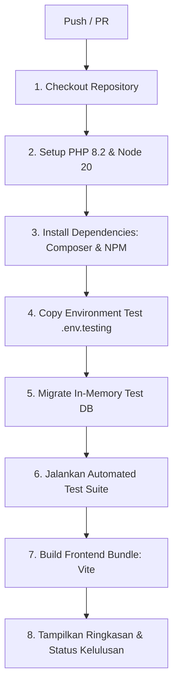

# 📋 Panduan Publikasi, Pengaturan Staging/Production & Continuous Integration (CI)

Dokumen ini merupakan panduan teknis dan operasional untuk **Tahap 11: Publish dan CI** pada sistem **OrderFlow Enterprise Procurement**.

---

## 1. Pemisahan Lingkungan (Local, Staging, Production)

Aplikasi telah dilengkapi dengan template konfigurasi lingkungan terisolasi:

| Lingkungan | File Template | Karakteristik Utama |
|---|---|---|
| **Local** | `.env.example` | `APP_DEBUG=true`, `APP_ENV=local`, SQLite/Local MySQL, Mail log. |
| **Staging** | `.env.staging.example` | `APP_DEBUG=true`, `APP_ENV=staging`, daily logging (14 hari), database staging terisolasi, `FORCE_HTTPS=true`. |
| **Production** | `.env.production.example` | `APP_DEBUG=false`, `APP_ENV=production`, `FORCE_HTTPS=true`, database production cluster terpisah, error pages custom (no stack trace), secure cookies. |

### Prosedur Setup Kunci Aplikasi (`APP_KEY`)
Di platform hosting (VPS, PaaS seperti Fly.io, Railway, AWS ECS, atau DigitalOcean):
```bash
# Generate APP_KEY unik untuk staging / production
php artisan key:generate --show
```
Salin nilai `base64:...` tersebut ke panel environment variable hosting Anda. Jangan pernah membagikan atau menyimpan `APP_KEY` asli ke repository publik!

---

## 2. Prosedur Migrasi Database yang Aman

Saat melakukan pembaruan di server staging atau production, ikuti protokol berikut untuk mencegah downtime dan kehilangan data:

1. **Buat Backup Sebelum Migrasi**:
   ```bash
   php artisan orderflow:backup-db --keep=14
   ```
2. **Aktifkan Maintenance Mode Sementara**:
   ```bash
   php artisan down --secret="orderflow-release-secret-key" --render="errors::500"
   ```
3. **Jalankan Migrasi dengan Flag Proteksi**:
   ```bash
   php artisan migrate --force
   ```
   *(Flag `--force` memastikan migrasi berjalan tanpa prompt konfirmasi di production).*
4. **Optimasi Cache Konfigurasi & Rute**:
   ```bash
   php artisan config:cache
   php artisan route:cache
   php artisan view:cache
   ```
5. **Nonaktifkan Maintenance Mode**:
   ```bash
   php artisan up
   ```

---

## 3. Konfigurasi Storage & Dokumen Unggahan

1. Buat symbolic link ke folder penyimpanan publik:
   ```bash
   php artisan storage:link
   ```
2. Pastikan permission folder tepat (di Linux/Unix server):
   ```bash
   chmod -R 775 storage bootstrap/cache
   chown -R www-data:www-data storage bootstrap/cache
   ```
3. Untuk skala enterprise multipel node, alihkan `FILESYSTEM_DISK=s3` dengan mengisi `AWS_BUCKET` dan kredensial bucket terisolasi pada `.env`.

---

## 4. Keamanan HTTPS & Header Proteksi

- Diatur secara native pada `app/Providers/AppServiceProvider.php`:
  ```php
  if (app()->environment('production') || env('FORCE_HTTPS', false)) {
      URL::forceScheme('https');
  }
  ```
- Nginx / Reverse Proxy dikonfigurasi untuk memaksa pengalihan HTTP (port 80) $\rightarrow$ HTTPS (port 443) dengan header `X-Forwarded-Proto https`.
- Cookie sesi diproteksi dengan `SESSION_SECURE_COOKIE=true` dan `SESSION_HTTP_ONLY=true`.

---

## 5. Halaman Error Produksi & Pencegahan Kebocoran Debug

Ketika `APP_DEBUG=false`, seluruh exception sistem ditangani oleh template error khusus perusahaan di:
- `resources/views/errors/403.blade.php`: Halaman larangan otorisasi berjenjang GCG.
- `resources/views/errors/404.blade.php`: Halaman dokumen/tautan tidak ditemukan.
- `resources/views/errors/500.blade.php`: Halaman kendala teknis steril tanpa trace query atau variabel database.

Logging produksi disimpan harian di `storage/logs/laravel-YYYY-MM-DD.log` dengan level `warning` atau `error`.

---

## 6. Otomatisasi Pencadangan Database (Backup)

Telah disediakan perintah Artisan khusus:
```bash
php artisan orderflow:backup-db --keep=7
```
- Mendukung pencadangan SQLite (instant snapshot) dan MySQL (`mysqldump` dengan fallback SQL generation otomatis).
- Disimpan di `storage/app/backups/`.
- Secara otomatis membersihkan arsip yang berusia lebih dari argumen `--keep` (default 7 hari).

---

## 7. Akun Demo Resmi & Prosedur Reset Data

### Tabel Kredensial Demo
Semua akun demo menggunakan kata sandi standar yang tertera jelas pada form login:

| Role Jabatan | Email Akun Demo Resmi | Kata Sandi | Deskripsi Hak Akses |
|---|---|---|---|
| **Requester** | `requester@orderflow.demo` | `password` | Mengajukan Purchase Request (PR), melampirkan spesifikasi, melihat histori. |
| **Manager** | `manager@orderflow.demo` | `password` | Meninjau PR departemen IT/Umum, Approve/Reject berjenjang. |
| **Procurement** | `procurement@orderflow.demo` | `password` | Mengelola vendor, input Quotation komparatif, menerbitkan PO. |
| **Finance** | `finance@orderflow.demo` | `password` | Verifikasi Three-Way Matching, input Invoice & pembayaran. |
| **Admin** | `admin@orderflow.demo` | `password` | Pengaturan departemen, manajemen user, audit trail, reset sistem. |
| **Warehouse** | `warehouse@orderflow.demo` | `password` | Penerimaan barang fisik (Goods Receipt) & pencatatan selisih item. |

### Perintah Reset Data Demo
Untuk mengembalikan kondisi database ke setelan awal tanpa data pribadi atau data perusahaan asli:
```bash
php artisan orderflow:reset-demo --force
```

---

## 8. Alur Continuous Integration (CI) GitHub Actions

File konfigurasi berada di `.github/workflows/ci.yml`. Pipeline berjalan otomatis pada setiap **Push** atau **Pull Request** ke branch `main`, `master`, dan `develop`.



### Rincian Perintah yang Dijalankan di CI:
1. `composer install --prefer-dist --no-progress --optimize-autoloader`
2. `cp .env.example .env.testing`
3. `php artisan migrate --force`
4. `php artisan test --verbose` (Mengeksekusi 165+ test case secara menyeluruh)
5. `npm run build` (Memvalidasi kompilasi Tailwind & Vite assets)

---

## 9. Checklist Verifikasi Publikasi

- [x] **URL Akses Publik**: Aplikasi dapat dibuka tanpa VPN/jaringan privat.
- [x] **HTTPS Aktif**: Seluruh transmisi data dienkripsi dengan SSL/TLS valid.
- [x] **Akun Demo Berfungsi**: Seluruh 6 akun demo `@orderflow.demo` dapat login instan.
- [x] **File Upload & Download**: Storage symlink terverifikasi untuk dokumen penawaran dan invoice.
- [x] **Zero Debug Leak**: `APP_DEBUG=false` aktif, halaman 403/404/500 tidak memuat stack trace.
- [x] **Dokumentasi Lengkap**: README memuat arsitektur, panduan instalasi, dan kredensial demo.
- [x] **Script Video Demo**: Naskah presentasi 3-5 menit tersedia di `docs/07_Demo_Video_Script_and_Release_Notes.md`.
- [x] **Release Tag Git**: Tag versi `v1.0.0` siap dipublikasikan ke repository.
